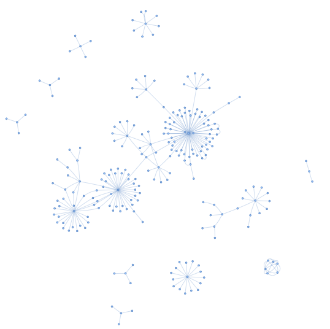

# RAGu

RAGu (Retrieval-Augmented Generation Utility) is a basic Graph RAG (Retrieval-Augmented Generation) system designed to facilitate the extraction and generation of information from text data using a graph-based approach. This system allows users to build a knowledge graph from text files and query it using natural language questions.

<p align="center">
  
</p>

## Features

- **Graph Construction**: Build a knowledge graph from the extracted text.
- **Customizable**: Easily extendable with new chunkers and rerankers.
- **Speed**: Less time on indexing by using special small models for NER, relation extraction and definition generating.

### !!! Getting answers on query doesn't works yet. Only graph construction

## Installation

To install RAGu, follow these steps:

1. Clone the repository:
   ```bash
   git clone https://github.com/AsphodelRem/RAGU
   cd RAGU
   ```

2. Install the required dependencies:
   ```bash
   python3 -m venv .venv
   . .venv/bin/activate
   pip install -r requirements.txt
   ```

## Usage

### Text Requirements

- The text should be in `.txt` format.
- The text files can be stored in nested folders.

### Example of Usage

Below is an example of how to use RAGu to build a knowledge graph and query it:

```python
from ragu.utils.io_utils import read_text_from_files
from ragu.utils.parameters import get_parameters
from ragu.common.llm import RemoteLLM
from ragu.graph.graph_rag import GraphRag


LLM_MODEL_NAME = "..."
LLM_BASE_URL = "..."
LLM_API_KEY = "..."
client = RemoteLLM(LLM_MODEL_NAME, LLM_BASE_URL, LLM_API_KEY)


def main():
    text = read_text_from_files('path/to/folder')

    chunker_params, triplet_params, reranker_params, generator_params, graph_params = (
        get_parameters('configs/default_config.yaml')
    )
    
    graph_rag = GraphRag(client).from_parameters(
        chunker_params,
        triplet_params,
        reranker_params,
        generator_params,
        graph_params
    ).build(text).save_community_summary('summary.json').save_graph('graph.gml')

    questions = [
        "Как звали последнего Императора России?",
        "Как звали детей последнего Императора Российской Империи?"
    ]

    for question in questions:
        print(f'Question: {question}, answer: {graph_rag.get_response(question, client)}')


if __name__ == "__main__":
    main()
```

### Example of visualization:
<p align="center">
  
</p>

## Configuration

The default configuration file is located at `configs/default_config.yaml`. You can customize the configuration by modifying this file or by passing additional configuration files.


## Contributing

Contributions are welcome! Please feel free to submit a pull request or open an issue if you have any suggestions or improvements.

## License

This project is licensed under the MIT License. See the [LICENSE](LICENSE) file for more details.

## Contact

For any questions or inquiries, please contact me at asphodel.rem@gmail.com.

---
